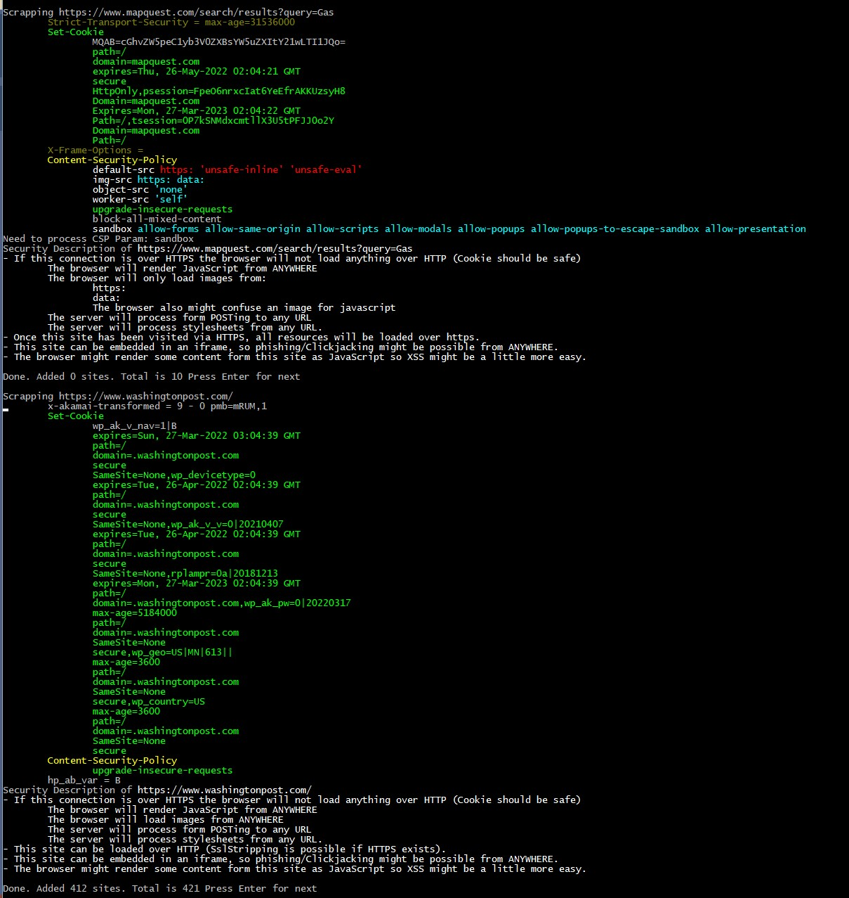
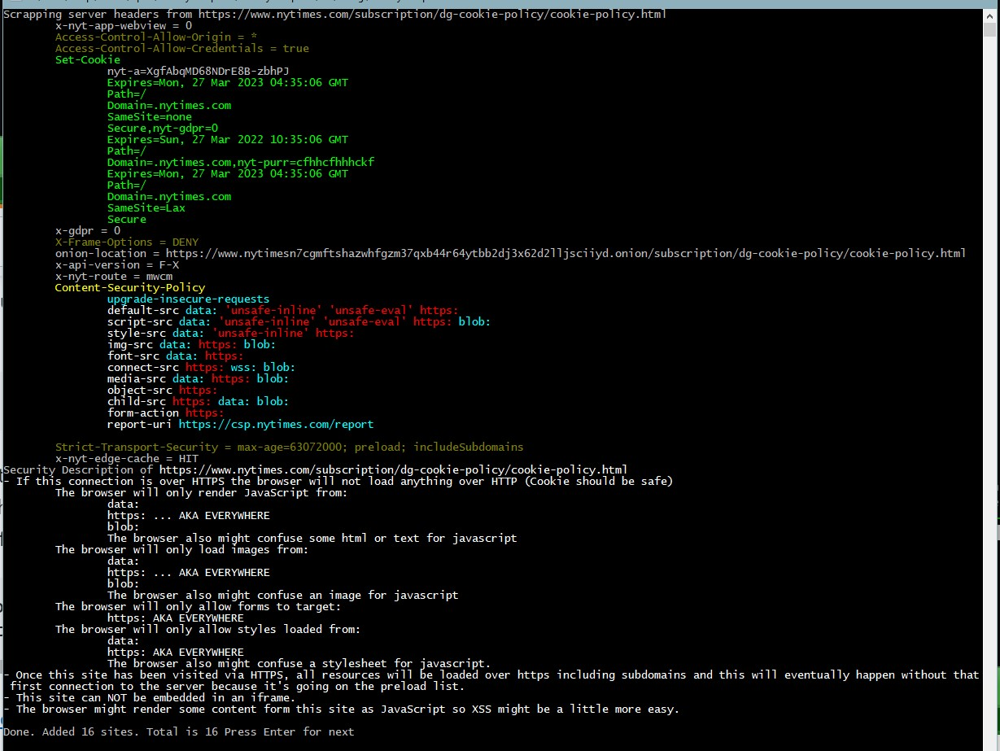

# Security Site Spider
@secure_sean 

March 2022





### [Download here](https://github.com/securesean/SecuritySiteSpider/releases/tag/v1.0)

## Description:
This is a PoC that spiders websites and lists security related information based on their response headers & meta tags and describes the site's security only based on that. 


This ignores all privacy related headers such as referrer-policy. This is just something I made because I like spiders and it helps me to learn and rememeber details about CSP, CORS, XSS, CSRF, and Cookie Security. Note: Since I prefer to see what's in the real world I didn't look at all of the standards/spec's/RFC's so there's always going to be new/missing/funky stuff.

## Arguements
```
SecuritySiteSpider.exe [-h|--help] [-shuffle|-randomize] [url url url...]
```

## ToDo:
- Highlight non-standard HTTP Headers allowed in 'Access-Control-Allow-Headers'. A webserver is telling you they allow it... and it's custom so it's probably ripe for abuse
- The current code just prints information about the CSP. I should analyze it a bit deeper: "Policies are combined by taking the intersection of the policies; that is to say, each policy after the first can only further restrict the allowed content, not broaden it." https://web.dev/fixing-mixed-content/  
- Take into account crossorigin attribute can be in the script tag - "anonymous" and "use-credentials" (aka cookie)
- Explain that the lack of a sandbox CSP will mean that a loaded iframe can prompt a download (research "csp and socgolish")
- detection for CSRF tokens
- Highlight non-standard HTTP Headers allowed in 'Access-Control-Allow-Headers'. A webserver is telling you they allow it... and it's custom so it's probably ripe for abuse
- Scrape the page because 
     the meta HTML tag can contain the Content Security Policy (and probably other things). (though not Content-Security-Policy-Report-Only).
         Ex: <meta http-equiv="Content-Security-Policy" content="upgrade-insecure-requests">
         https://web.dev/fixing-mixed-content/ says "Policies are combined by taking the intersection of the policies; that is to say, each policy after the first can only further restrict the allowed content, not broaden it."
     crossorigin attribute can be in the script tag - "anonymous" and "use-credentials" (aka cookie)
- Store everything in a Log File
- Create better method to find links
- If given just a path, just discard it
- Load url list from file
- Look at https://developer.mozilla.org/en-US/docs/Glossary/CORS-safelisted_response_header
- Store everything in a 'mark as interesting' feature
- Let me google that for you
- Store everything in a DataBase
- Somehow Trigger the accept cookie
- print non-standard headers: https://en.wikipedia.org/wiki/List_of_HTTP_header_fields
- Codify everything on this site: https://www.geeksforgeeks.org/http-headers/
- Create better method to find links to FQDN's
- Load url list from file
- Look at https://developer.mozilla.org/en-US/docs/Glossary/CORS-safelisted_response_header
- Store everything in a 'mark as interesting' feature
- Let me google that for you
- Store everything in a DataBase
- Somehow Trigger a generic 'accept cookie' 
- print non-standard headers: https://en.wikipedia.org/wiki/List_of_HTTP_header_fields

## Ideas:
- Make a list of setFrameOptions not setting their value, and look up on hackerone
- Build a visual web of trust based on all the CSP's
- Submit every URL to an analzer to see if the domain host content for us (like pastebin, or CDN), and see if VT has anything on it
- Gernated a (basic) CSP that wouldn't break anything. wget mirror -> Create a Content-Security-Policy that won't break anything
   - Is there an easy way to drive the browser, and get the Console errors?
   - Note: SVG images seem to require the 'data:'
   - Basics: Xss_NoMimeSniffing, reffer policy set to send no data, 
   - How would I account for dynamic javascript loading resources?
   
## Others who have done something similar:
* https://github.com/researchapps/url-headers
* https://httpschecker.net/how-it-works#httpsChecker
* https://github.com/bramus/mixed-content-scan
