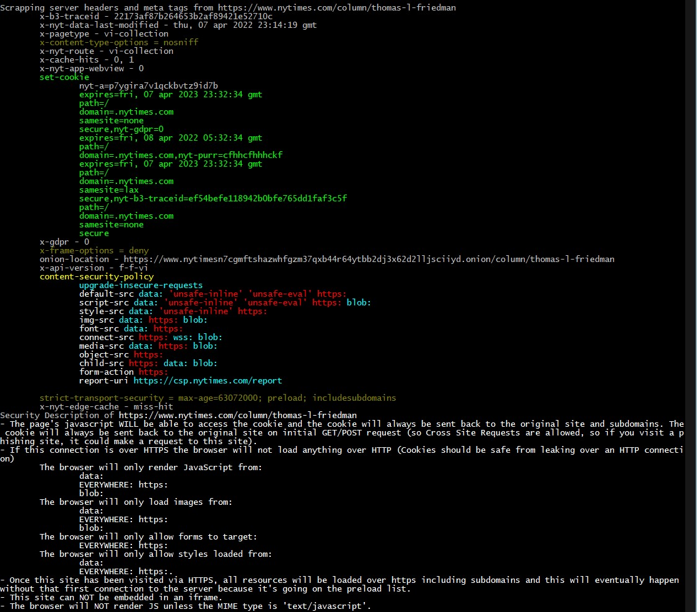

# Security Site Spider
@secure_sean 

March 2022

## Description:
This is a PoC I wrote (poorly) in one day that spiders websites while listing their response headers and describes the web servers security ONLY based on those headers. 

This ignores all privacy related headers such as referrer-policy. This is just something I made because I like spiders and it helps me to learn and rememeber if I codify my knowledge. Note: I build this on what I found on the internet, I didn't look at all of the standards/spec's/RFC's so there's always going to be  new/missing/funky stuff (I prefer to see what's the the real world).

ToDo:
- Print description about the Cookie and it's attributes
- Highlight non-standard HTTP Headers allowed in 'Access-Control-Allow-Headers'. A webserver is telling you they allow it... and it's custom so it's probably ripe for abuse
- Scrape the page because 
     the meta HTML tag can contain the Content Security Policy (and probably other things). (though not Content-Security-Policy-Report-Only).
         Ex: <meta http-equiv="Content-Security-Policy" content="upgrade-insecure-requests">
         https://web.dev/fixing-mixed-content/ says "Policies are combined by taking the intersection of the policies; that is to say, each policy after the first can only further restrict the allowed content, not broaden it."
     crossorigin attribute can be in the script tag - "anonymous" and "use-credentials" (aka cookie)
- Store everything in a Log File
- Create better method to find links
- If given just a path, just discard it
- Load url list from file
- Look at https://developer.mozilla.org/en-US/docs/Glossary/CORS-safelisted_response_header
- Store everything in a 'mark as interesting' feature
- Let me google that for you
- Store everything in a DataBase
- Somehow Trigger the accept cookie
- print non-standard headers: https://en.wikipedia.org/wiki/List_of_HTTP_header_fields

Ideas:
- Make a list of setFrameOptions not setting their value, and look up on hackerone
- We could build a web of trust
- Submit every URL to an analzer to see if the domain host content for us (like pastebin, or CDN), and see if VT has anything on it
- wget mirror -> Create a Content-Security-Policy that won't break anything
   - Is there an easy way to drive the browser, and get the Console errors?
   - Note: SVG images seem to require the 'data:'
   - Basics: Xss_NoMimeSniffing, reffer policy set to send no data, 